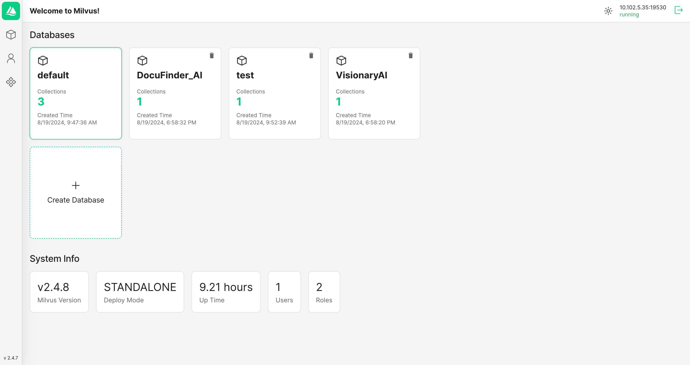

# Install Milvus in Docker

Milvus provides an installation script to install it as a docker container. The script is available in the [Milvus repository](https://raw.githubusercontent.com/milvus-io/milvus/master/scripts/standalone_embed.sh). To install Milvus in Docker, just run

```bash
# Download the installation script
wget https://github.com/milvus-io/milvus/releases/download/v2.6.3/milvus-standalone-docker-compose.yml -O docker-compose.yml

# Start the Docker container

sudo docker compose up -d
```
## Attu



Attu is designed to manage and interact with Milvus, offering features such as:

- **Database, Collection, and Partition Management:** Efficiently organize and manage your Milvus setup.
- **Insertion, Indexing, and Querying of Vector Embeddings:** Easily handle Milvus vector data operations.
- **Performing Vector Search:** Rapidly validate your results using the vector search feature.
- **User and Role Management:** Easily manage Milvus permissions and security.
- **Viewing System Topology:** Visualize Milvus system architecture for better management and optimization.

**Running Attu from Docker**

Here are the steps to start a container for running Attu:

```
docker run -d -p 8000:3000 -e MILVUS_URL={milvus server IP}:19530 zilliz/attu:v2.6
```

Make sure that the Attu container can access the Milvus IP address. After starting the container, open your web browser and enter `http://{ Attu IP }:8000` to view the Attu GUI.

### Run Milvus with Attu using docker compose

```jsx
version: '3.5'

services:
  etcd:
    container_name: milvus-etcd
    image: quay.io/coreos/etcd:v3.5.18
    environment:
      - ETCD_AUTO_COMPACTION_MODE=revision
      - ETCD_AUTO_COMPACTION_RETENTION=1000
      - ETCD_QUOTA_BACKEND_BYTES=4294967296
      - ETCD_SNAPSHOT_COUNT=50000
    volumes:
      - ${DOCKER_VOLUME_DIRECTORY:-.}/volumes/etcd:/etcd
    command: etcd -advertise-client-urls=http://etcd:2379 -listen-client-urls http://0.0.0.0:2379 --data-dir /etcd
    healthcheck:
      test: ["CMD", "etcdctl", "endpoint", "health"]
      interval: 30s
      timeout: 20s
      retries: 3

  minio:
    container_name: milvus-minio
    image: minio/minio:RELEASE.2024-12-18T13-15-44Z
    environment:
      MINIO_ACCESS_KEY: minioadmin
      MINIO_SECRET_KEY: minioadmin
    ports:
      - "9001:9001"
      - "9000:9000"
    volumes:
      - ${DOCKER_VOLUME_DIRECTORY:-.}/volumes/minio:/minio_data
    command: minio server /minio_data --console-address ":9001"
    healthcheck:
      test: ["CMD", "curl", "-f", "http://localhost:9000/minio/health/live"]
      interval: 30s
      timeout: 20s
      retries: 3

  standalone:
    container_name: milvus-standalone
    image: milvusdb/milvus:v2.6.3
    command: ["milvus", "run", "standalone"]
    security_opt:
      - seccomp:unconfined
    environment:
      ETCD_ENDPOINTS: etcd:2379
      MINIO_ADDRESS: minio:9000
      MQ_TYPE: woodpecker
    volumes:
      - ${DOCKER_VOLUME_DIRECTORY:-.}/volumes/milvus:/var/lib/milvus
    healthcheck:
      test: ["CMD", "curl", "-f", "http://localhost:9091/healthz"]
      interval: 30s
      start_period: 90s
      timeout: 20s
      retries: 3
    ports:
      - "19530:19530"
      - "9091:9091"
    depends_on:
      - "etcd"
      - "minio"

  attu:
    container_name: milvus-attu
    image: zilliz/attu:v2.6
    environment:
      - MILVUS_URL=standalone:19530
    ports:
      - "8000:3000"
    depends_on:
      - "standalone"
    healthcheck:
      test: ["CMD", "curl", "-f", "http://localhost:3000"]
      interval: 30s
      timeout: 20s
      retries: 3

networks:
  default:
    name: milvusroot

```